# StudentGradePredictor
This project takes the data of scores of mathematics for two schools in Europe.
We tried to solve both the regression problem and classification problem.
Regression problem is done by trying the predict the final marks achieved by a student.
Classification problem can be answered if we can decide a student can pass or fail in the final exam.
Considered different models for both regression and classification, then we compared the results and chose the best one for each problem.

## Introduction

### Goal

Develop a predictive model that accurately forecasts student grades based on various relevant features, ultimately assisting educators and institutions in identifying at-risk students and providing tailored support. This predictive model aims to enhance the educational experience by enabling early intervention for students who may be struggling academically, leading to improved learning outcomes. The present work intends to approach student achievement in secondary education for a school in Portugal, Europe. The aim is to predict student achievement and if possible to identify the key variables that affect educational success/failure, using recent real-world data (e.g. student grades, demographic, social and school related features) collected from reports and
questionnaires.

### Overview
In Portugal, the secondary education consists of 3 years of schooling, preceding 9 years of
basic education and followed by higher education. Most of the students join the public and free
education system. There are several courses that share core subjects such as the Portuguese
Language and Mathematics. Like several other countries a 20-point grading scale is used,
where 0 is the lowest grade and 20 is the perfect score. During the school year, students are
evaluated in three periods and the last evaluation corresponds to the final grade.
This study considers data collected during the 2005-2006 school year from two public schools,
from the Alentejo region of Portugal. Although there has been a trend for an increase of
Information Technology investment from the Government, the majority of the Portuguese public
school information systems are very poor, relying mostly on paper sheets. Hence, the database
was built from two sources: school reports, based on paper sheets and including few attributes
(i.e. the three period grades and number of school absences); and questionnaires, used to
complement the previous information.

### Proposed Architecture
From the two core classes (i.e. Mathematics and Portuguese), one will be modeled under the
following methodologies:
1. Binary classification (pass - 1 / fail - 0)
2. Regression, with a numeric output that ranges between zero (0%) and twenty (100%)

For each of these approaches, three input setups (e.g. with and without the school period
grades) and five algorithms such as Decision Trees, Random Forest, Linear, Ridge and
SVM will be tested. Moreover, an explanatory analysis will be performed over the best models,
in order to identify the most relevant features.  

## Data
This dataset contains information about student achievement in secondary education of two
Portuguese schools. The data attributes include student grades, demographic, social and
school-related features collected through school reports and questionnaires.  

It is important to note that the target attribute G3 has a strong correlation with attributes G2 and
G1. This occurs because G3 is the final year grade (issued at the 3rd period), while G1 and G2
correspond to the 1st and 2nd period grades. We hypothesize that it is more difficult to predict
G3 without G2 and G1, but such prediction is much more useful.   

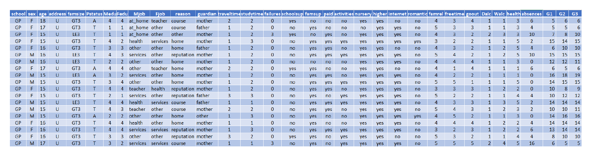  

The dataset in consideration includes records of 395 students from two public schools studying
the subject Mathematics.  

The data consists of 32 predictors as well as 1 response variable (G3) for regression.
The attributes are divided into:
- 16 Categorical Features
- 16 Continuous Features
- 1 Target Variable

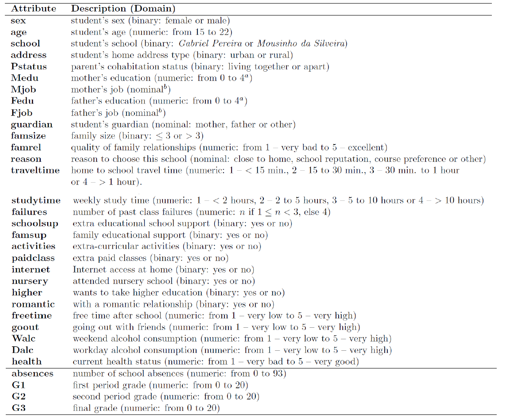  
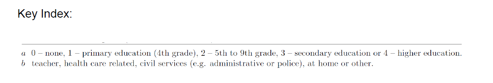  

### Attribute Categorizing
To help us better understand the nature of the attributes that may be significant in
predicting a student’s grade, we categorized the feature variables into four different
categories which are as follows:

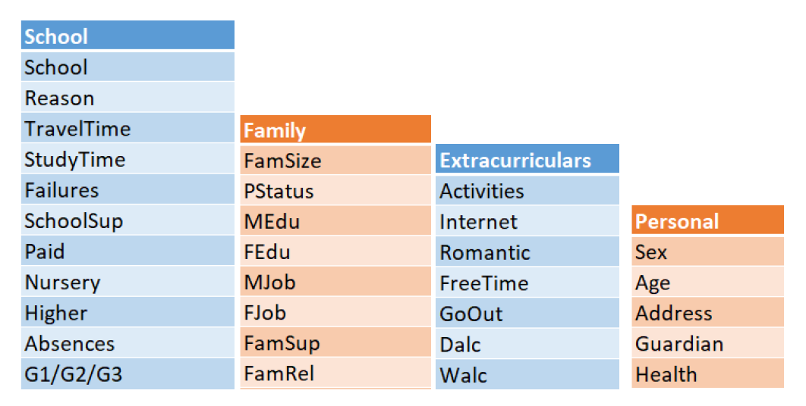  

- **School**:
These attributes involve the information related to a student’s school life, including the
reason why they chose a particular school, how much time they spend studying, their
previous grades as well as the number of absences from school.  
- **Family**:
These features consist of each students’ family information like their parents’ education,
parents’ jobs, how much they support their children and how their relationship is with
their children etc.  
- **Extracurriculars**:
The predictors related to a student’s free time, romantic relationships, how much they
go out or how much alcohol they consume have been grouped together under the
extracurriculars category.  
- **Personal**:
The attributes consist of an individual’s demographics including their age, sex, address
and health.  

## Exploratory Data Analysis
**Average grade between the schools**

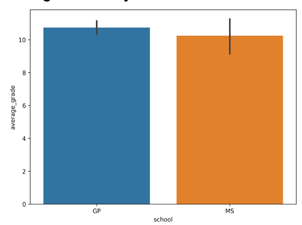  

From the graph we can see that school
does not play a significant role for a
student’s grade prediction as they have
a similar trend of grades overall.

**Grade Distribution Based on Age**

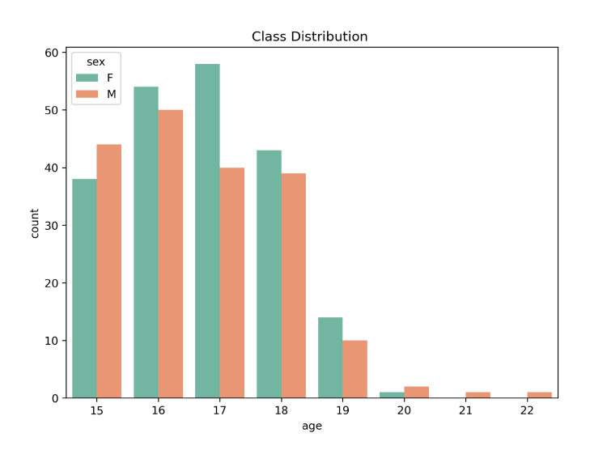  

From the graph we can understand that students’ age range is from 14 to 22
years. The histogram shows that most of the students are aged between 15 and
18, which makes sense since most students start high school around the age of
15 and graduate by 18 given the fact that generally, high schools around the
world last 3-4 years. However, there are 29 students older than 18 years of age.
On average, female students are more than male students.

**Do girls perform better than boys?**  

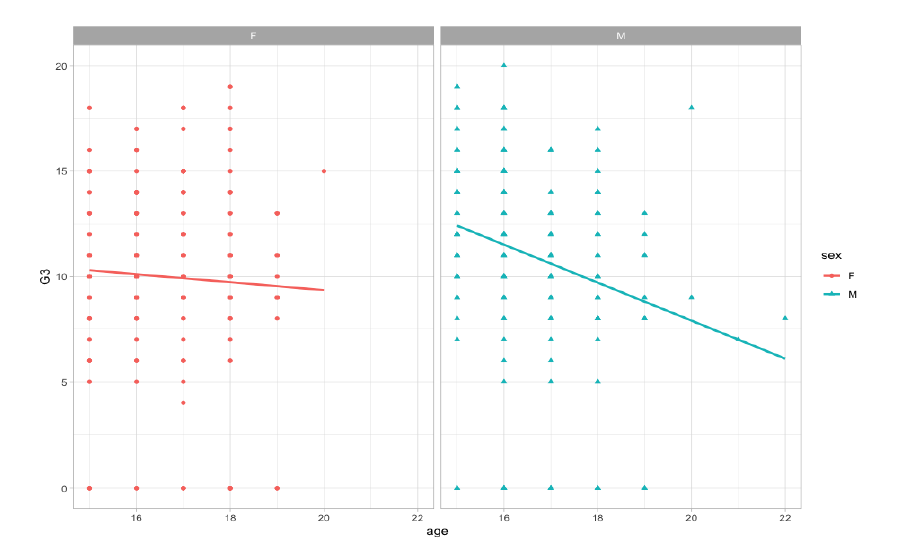  

It can be seen that girls’ performance improves with age, however, a decrease in the
boys’ performance can be detected in the graph.  

**Student’s Performance on the basis of Parents’ Education**

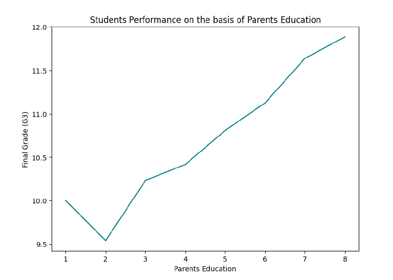   

As expected, the higher the level of parents’ education is, the higher their children’s
score at school. Students whose parents have higher levels of education may have an
enhanced regard for learning, more positive ability and beliefs, a stronger work
orientation, and may use more effective learning strategies.  

**Distribution of Final Grade of Students**  

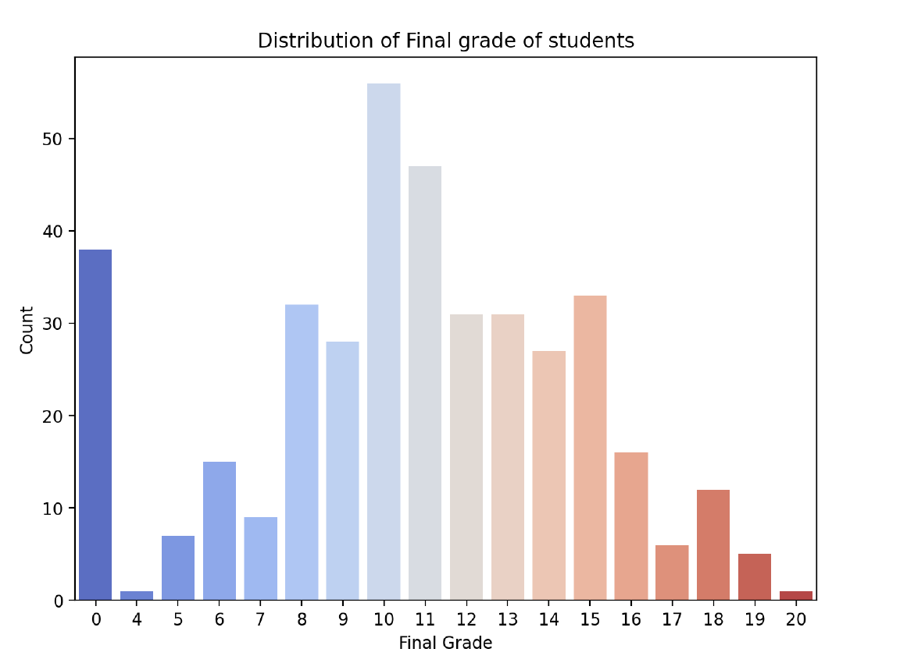  

Most students can be seen to have received a borderline passing score of 10 or 11.
While many students received a zero, which was the 3rd highest count in this case, i.e
9.62% of the students.
Very few students received a full score of 20 which is 0.2% of the class size.  

**Study time Distribution**  

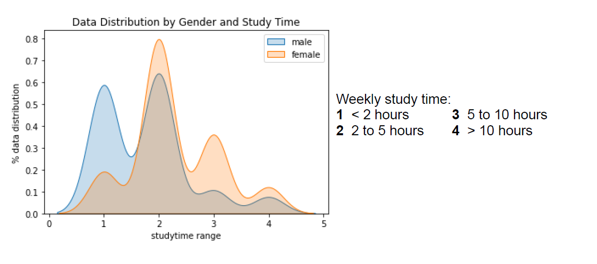  

It can be seen that male students hardly studied for 2 hours a day, however most girls
studied between 2.5 hrs to 5.5 hrs. Moreover, few percent of female students have also
studied for more than 5 hours a day.  

**Free time Distribution**  

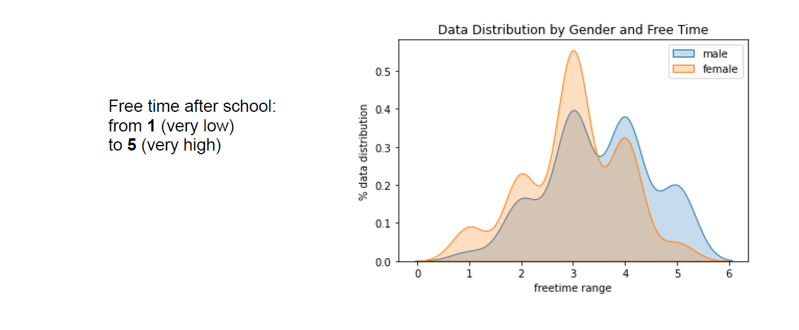  

While female students study for more hours a day than male counterparts, as a result
they get less free time than male students.  

**Correlation between Features**  

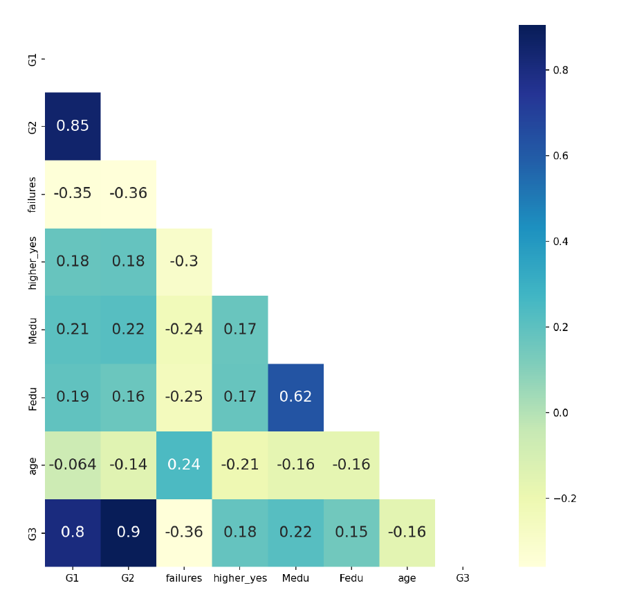   

Our target variable is ‘G3’, so we check the correlation of other variables with it and find
that ‘G1’, ‘G2’, ‘failures’, ‘higher_yes’, ‘Medu’, ‘Fedu’, ‘age’ are amongst the top most
correlated variables with ‘G3’.  

## Preprocessing
1. **Removing Null Values**: Searched for NULL values to remove or impute but did not find any in this dataset.
2. **One-hot Encoding**: In order to use the machine-learning libraries we must convert the categorical data variables into dummy variables. This is called a One-Hot encoding technique where unique values in each categorical variable get a separate column.
3. **Drop Redundant Columns**: We dropped the redundant columns which represent the same type of information such as romantic_no, famsize_LE3 as the info is captured in the columns romantic_yes, famsize_GT3.
4. **Train-Test Split**: We have used ’train_test_split’ to split the dataset such that 75% of the data is used for training and 25% for testing.
5. **Normalization**: Rescaling of the data from the original range so that all values are within the new range of 0 and 1 is called Min-Max normalization. We used min-max scalar so that all the features are with-in [0,1] range.

## Model
We worked on 3-scenarios:
- Setup-A : When the grades ‘G1’ and ‘G2’ both were excluded.
-  Setup-B : When the grade ‘G1’ is only included.
-   Setup-C : When the grades ‘G1’ and ‘G2’ both were included.
  
We have addressed both Regression and Classification problems.
The main difference is set in-terms of output representation, the output variable is
continuous in a regression problem and discrete for a classification setting.  

## Regression
We implemented the following regression models:
1. Linear Regression
2. Ridge Regression
3. Support Vector Regression
4. Decision Tree Regression
5. Random Forest Regression
   
We have used “Mean Squared Error” (MSE) as the metric to measure the performance
of the regression models. The lower the value the better the performance.  

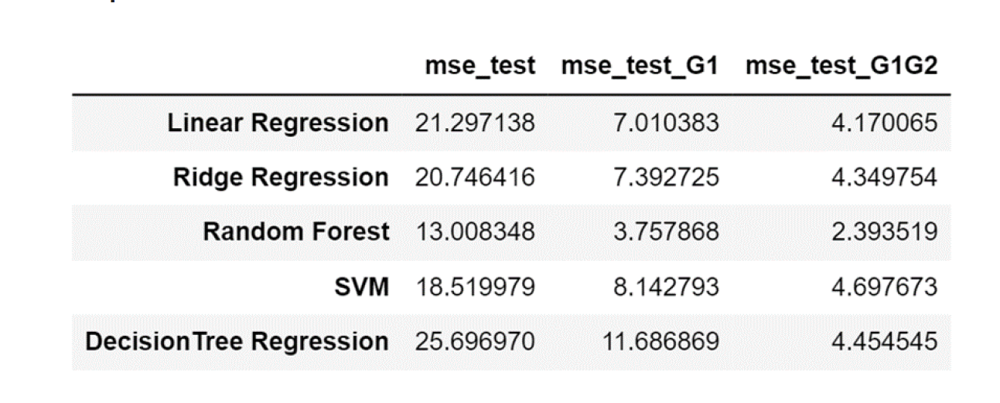  

**From above we can see that:**
Inclusion of either G1 or both G1 and G2 variables have reduced the error values in all
the algorithms.
It can be seen that the Random Forest Regression model out-performed other models.
We also checked the Coefficient of Determination (R-squared value) as well and found
out that Random Forest has the highest R-squared value.

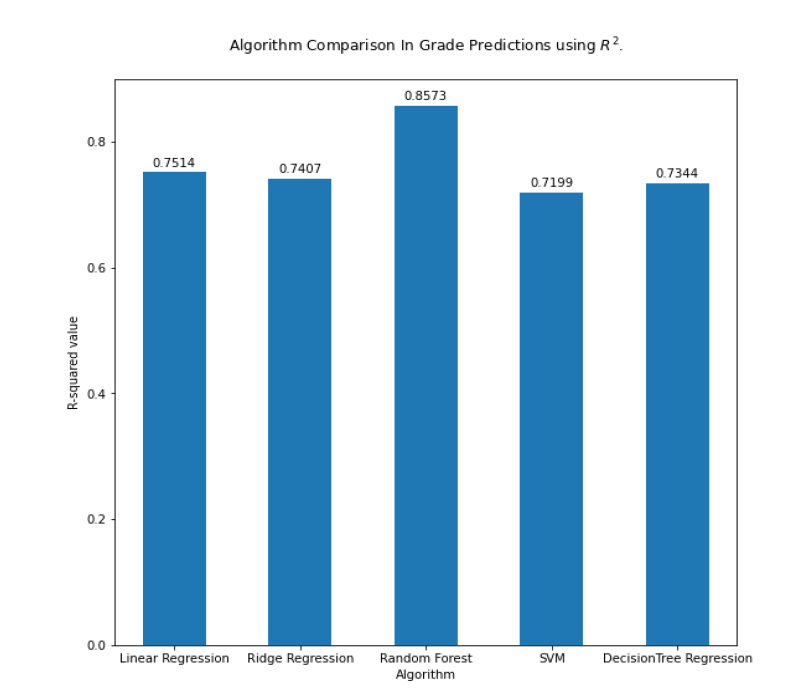  

After the comparison of R-squared values for various regression models, it was found that
random forest algorithms performed better. This can be seen from above graph.  

## Classification
We have addressed the classification problem for this dataset as well due to its dual nature of
variables and existence of categorical features.
For this first of all we need to have our response variable to be in terms of labels.
If a student scores greater than 10 in ‘G3’ he passes the exam, else he fails.
So, we encoded the response variable to 1 if ‘G3 > 10’, else 0.

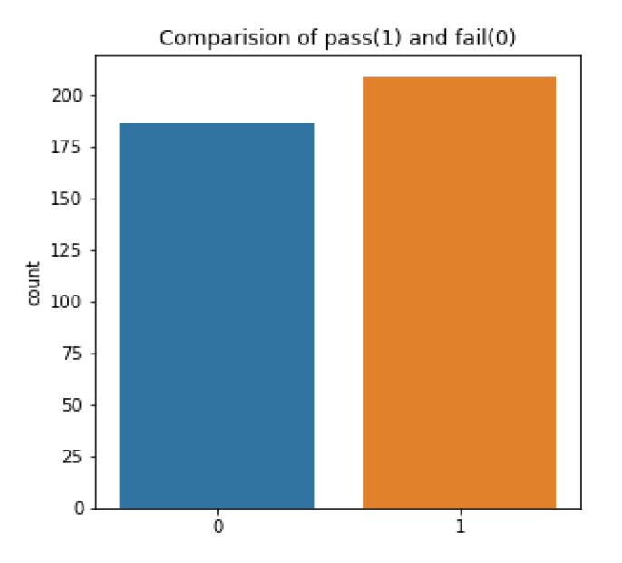  

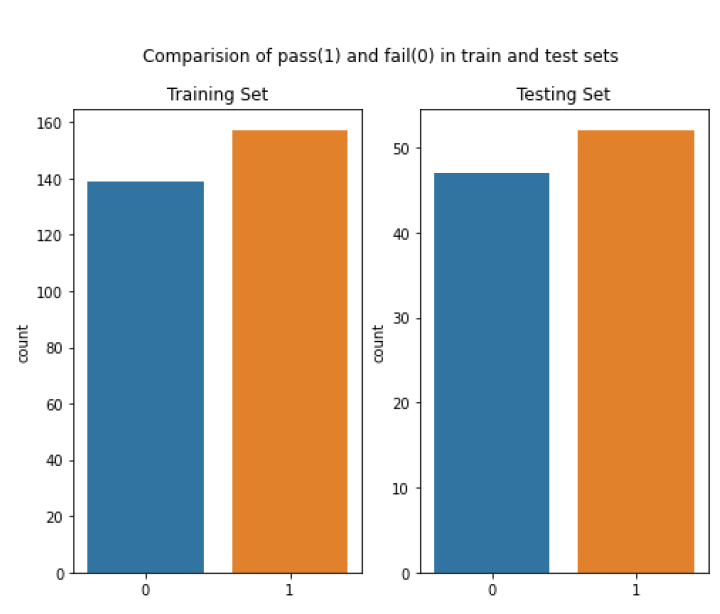  

### Evaluation metrics
**Receiver Operating Characteristic Curve**: An ROC curve (receiver operating characteristic curve) is a graph showing the
performance of a classification model at all classification thresholds. This curve plots two parameters: True Positive Rate, False Positive Rate.  

**True Positive Rate (TPR)** is a synonym for recall and is therefore defined as follows:  
TPR = TP / TP+FN  

**False Positive Rate (FPR)** is defined as follows:  
FPR = FP / FP+TN  

**Area Under the Curve**
AUC stands for "Area Under the ROC Curve".  
AUC measures the entire two-dimensional area underneath the entire ROC curve (think
integral calculus) from (0,0) to (1,1).  
Model with higher AUC is better.  

We tried various classifications algorithms namely:
1. LogisticRegression
2. KNeighborsClassifier
3. Support Vector Classifier (SVC)
4. DecisionTreeClassifier
5. RandomForestClassifier

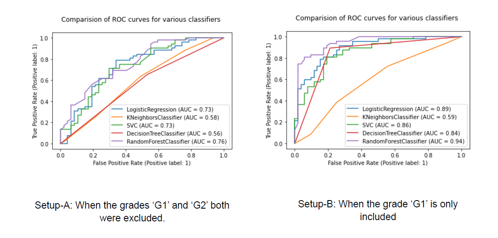  

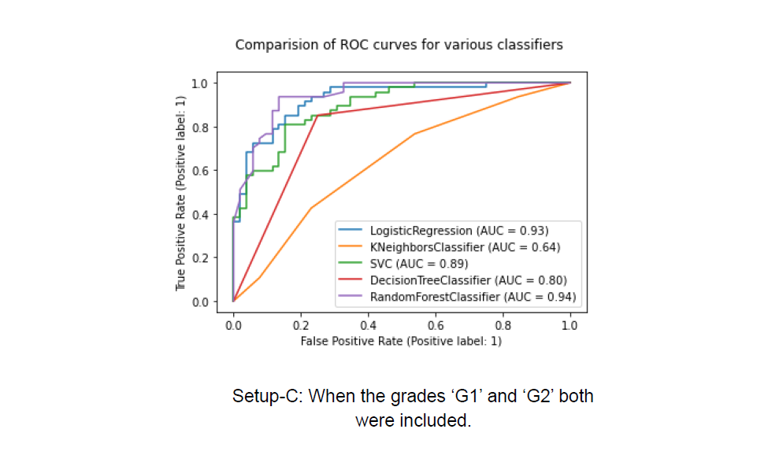  

From the above graphs we can see that Random Forest Classifier has better AUC score compared to other models.  

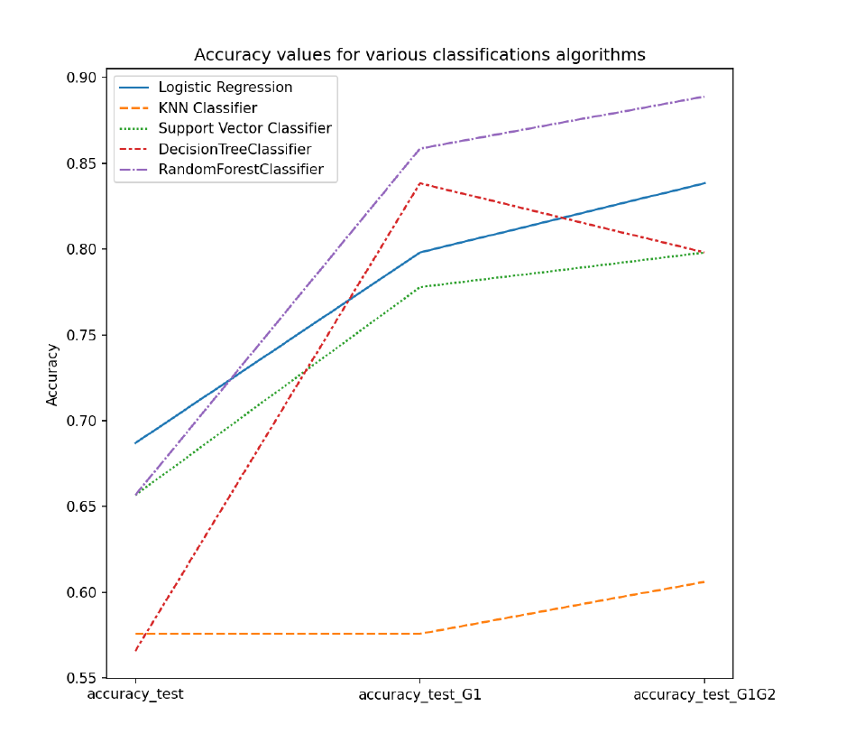  

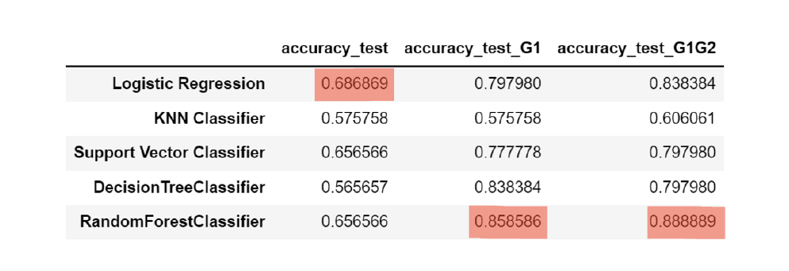  

By adding G1 only, or G1 and G2 both variables increases the accuracy score in all
algorithms except in the Decision Tree Classifier.
Also, excluding both G1 and G2 the accuracy of the Logistic Regression model is
best.
The Random Forest model gives better accuracy in all other scenarios.  

## Improving the Results
1. **Bagging (Bootstrap Aggregation)**:
Decisions trees are very sensitive to the data they are trained on — small
changes to the training set can result in significantly different tree structures.
Random forest takes advantage of this by allowing each individual tree to
randomly sample from the dataset with replacement, resulting in different trees.
Instead of the original training data, it takes a random sample of size N with
replacement.

2. **Hyperparameter tuning**:
Hyperparameters are used in random forests to either enhance the
performance and predictive power of models or to make the model faster.
Following hyperparameters increased the predictive power for our model:
    - n_estimators– number of trees the algorithm builds before averaging
the predictions.
    - max_features– maximum number of features random forest considers
splitting a node.
    - mini_sample_leaf– determines the minimum number of leaves
required to split an internal node.

We used stratifiedKFold for tuning the hyperparameters such as max_depth,
n_estimators.We used 10-Fold CV for tuning and used cross_val_score with
scoring metric set to “accuracy”. We found the max_depth of 6 gives better
accuracy for this setting and we plotted the tree from it.

3. **Splitting Criteria:**
The decision-trees from the random-forest classifier uses gini-index for the
splitting criteria.

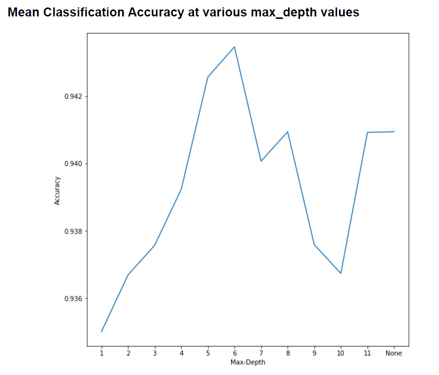  

For the max_depth = 6 and n_estimators = 51, the random forest produced the
accuracy of 0.92929.  

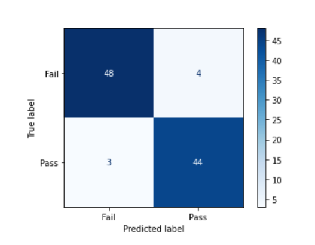   

   
From the above confusion matrix, we can see that our model’s mis-classifications are
minimal.  

The resulting tree shows one of the decision-trees from the random-forest classifier
which uses gini-index for the splitting criteria.
Therefore, the best random forest is plotted below:  

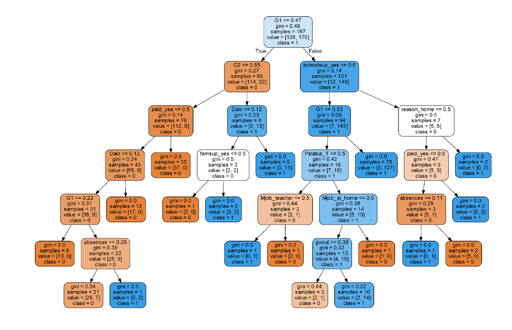   

The random forest uses gini-index criteria for making a decision at a node. Similarly,
for each split, we will calculate the Gini impurities and the split producing minimum
Gini impurity will be selected as the split. The minimum value of Gini impurity means
that the node will be purer and more homogeneous.  

## Conclusion
The results show that a good predictive accuracy can be achieved, provided that the
first and/or second school period grades are available. Although student achievement
is highly influenced by past evaluations, an explanatory analysis has shown that there
are also other relevant features (e.g. performance by gender, parent’s job and
education, time spent studying vs time spent free).
As a direct outcome of this project, more efficient student prediction tools can be
developed, improving the quality of education and enhancing school resource
management.
